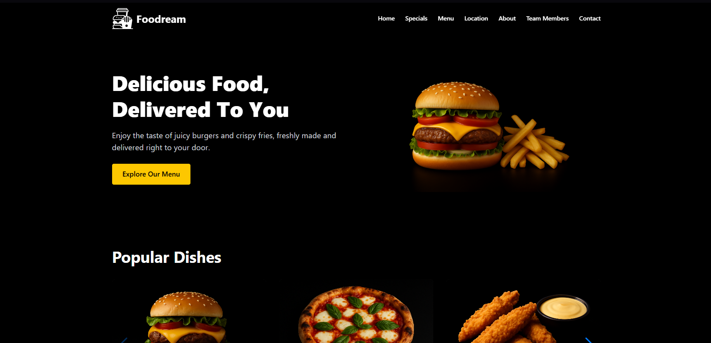
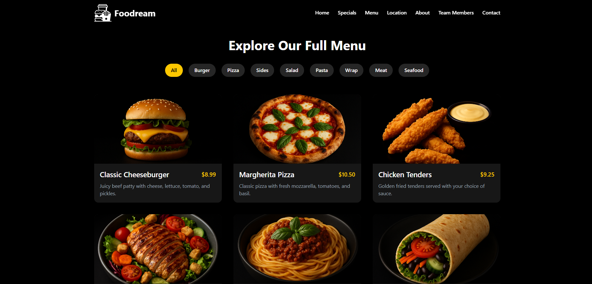

# 🍔 Foodream - Fast Food Landing Page

**Foodream** is a fictional fast food franchise landing page built as a personal project to showcase frontend and backend integration with contact functionality. It is designed with modern web technologies including React, Vite, TailwindCSS and Node.js.

## 🚀 Project Overview

This is a fully responsive landing page that includes sections like a hero area, featured menu items, seasonal offers, location map, testimonials, about us, and a contact form. The backend uses **Node.js + Express + Nodemailer** to handle contact form submissions via email.

## 🖼️ Screenshots

### 🏠 Homepage


### 🍕 Menu Section


## 📦 Folder Structure

```
/Foodream
├── fastfood-landing/     # Frontend (Vite + React + Tailwind)
└── backend/              # Backend (Node.js + Express + Nodemailer)
```

---

## ⚙️ Installation & Run Guide

### 1. Clone or download the repository
Unzip the downloaded project.

### 2. Run the frontend (React app)

```bash
cd fastfood-landing
npm install
npm run dev
```

This starts the frontend on `http://localhost:5173`

### 3. Run the backend (Node.js API)

In a separate terminal:

```bash
cd backend
npm install
npm start
```

This starts the backend on `http://localhost:3000`

### 4. Configure environment variables

In the `/backend` directory, create a `.env` file with the following content:

```
MAIL_USER=your_email@gmail.com
MAIL_PASS=your_app_password
```

> ⚠️ Make sure your Gmail account has **2-Step Verification enabled** and use an **App Password** for `MAIL_PASS`.

---

## ✉️ Contact Form

The contact form at the bottom of the site sends messages via email using Nodemailer. You must correctly set up your `.env` file for this feature to work.

---

## 📄 License

This project is licensed under a proprietary license.  
© 2025 Esteuryn Fuentes. All rights reserved.

You may not copy, distribute, or use this code without explicit permission.